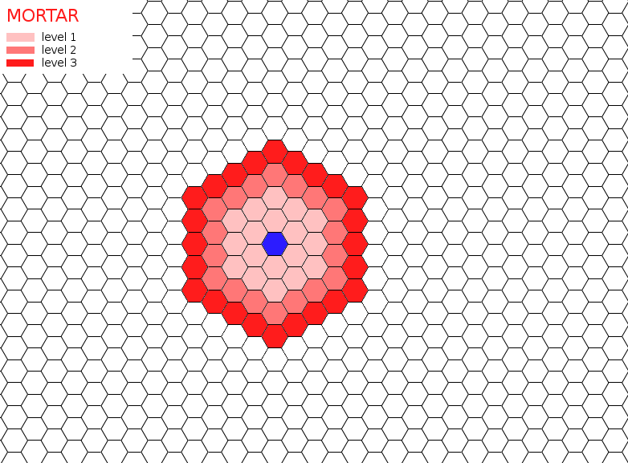
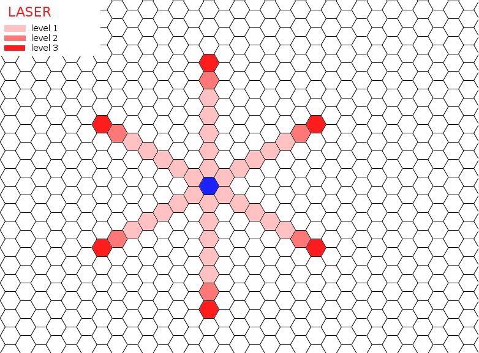
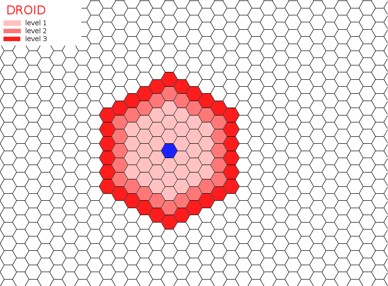

#AI KONKURRANSE (tidl. "Hardcore Programming")
Det er år 2400. Konføderasjonen ligger i ruiner. Alt som
gjenstår av det en gang store imperiet er spredte ruiner av
de intergalaktiske havnene; imperiets gamle "Skyports".

Meteor regn herjer skyportene fra den asurblåe stratosfæren.
Samtidig gjør stammene seg klare til et nytt slag på den
svevende slagmarken.

Du har blitt valgt til ansvaret om å skape den perfekte-kamp
roboten til å utslette dine fiender i et hav av laserstråler
og eksplosjoner. Programmer din robot til å oppgradere våpen,
skyte fiender og dominere skyporten.

=======

#SKYPORT REV 1 SPILL REGLER
========================

##SAMMENDRAG

Dette dokumentet tar for seg reglene i spillet, implementert av serveren.

##KART

Kartet er et sekskantet rutenett. Se PROTOCOL_NO/KART-OBJEKT for videre
informasjon. Kartet bruker et koordinatsystem likt det i et vanlig firkantet
rutenett:

     J-Koordinat                       K-Koordinat
      \                               /
       \                             /
        \                _____      /
         \         <0>  /     \  <0>
          \            /       \
           \     ,----(   0,0   )----.
            <1> /      \       /      \ <1>
         _____ /  1,0   \_____/  0,1   \_____
    <2> /      \        /     \        /     \  <2>
       /        \      /       \      /       \
      (   2,0    )----(   1,1   )----(   0,2   )
       \        /      \       /      \       /
        \_____ /  2,1   \_____/  1,2   \_____/
               \        /     \        /
                \      /       \      /
                 `----(   2,2   )----'
               .       \       /      .
              .         \_____/        .
             .                          .
	      
Rutenes posisjon er alltid skrevet [J,K]; J-koordinatet kommer alltid f�rst og
K-koordinatet sist. For eksempel; en AI vil kanskje sende en melding om � "flytte
til posisjonen 1,0" og s� "angrip med mortar (granatkaster) p� posisjonen
2,2". Serveren vil da flytte AI'en til posisjon [2,0] og angripe posisjonen
[2,2].  
Du kan bevege deg mellom ruter over grensene mellom rutene, og opp til 3 ruter p�
en tur.
Det er syv forskjellige rute typer, dette vil bli forklart n�rmere i neste avsnitt.

##RUTER

###FARBARE RUTER (ruter du kan flytte til)
* **GRESS**	- Gressrute. Ingen spesiell effekt. Kan komme i flere farger og
former, men roboter er ikke opptatt av estetikk.  
* **EXPLOSIUM**	- Hvis du st�r p� denne ruten kan du bruke en eller flere 
handlinger p� � utvinne explosium ressurs, 1 ressurs per handling. Hver explosium
 rute har maksimum 2 tilgjengelige ressurser. Etter at en rute er oppbrukt vil
 den forvandles til en gress rute.  vis du er it is depleted, it turns into
 grass.
* **RUBIDIUM**	- Hvis du st�r p� denne ruten kan du bruke en eller flere 
handlinger p� � utvinne rubidium ressurs, 1 ressurs per handling. Hver rubidium 
rute har maksimum 2 tilgjengelige ressurser. Etter at en rute er oppbrukt vil den
forvandles til en gress rute.
* **SKRAP**	- Hvis du st�r p� denne ruten kan du bruke en eller flere 
handlinger p� � utvinne metall, 1 ressurs per handling. Hver skrap rute har
maksimum 2 tilgjengelige ressurser. Etter at en rute er oppbrukt vil den 
forvandles til en gress rute.

###UFARBARE RUTER
* **VOID**(TOM)	- Tomme ruter.
* **SPAWN**(START)	- Beskyttet startomr�de. Det vil ikke v�re mulig � g� 
tilbake til disse rutene etter at du har g�tt av dem.
* **ROCK**(STEIN)	- En stein som stenger for veien.

##TUR
Hver runde f�r hver AI tre handlinger. En AI kan bruke handlingene til � flytte
seg (1 rute per handling), skyte ett v�pen, vente eller utvinne ressurser. � 
skyte et v�pen vil avslutte runden og bruke de resterende handlingene p� skuddet.
De ekstra handlingene vil �ke skaden som skuddet gj�r. Venting vil gi en liten 
poeng- og helse- straff, dette betyr ogs� at inaktive AI'er vil bli kastet ut 
etter en stund.
Etter at AI'ens runde er over; vil en spillstatus bli sendt til alle AI'er, og 
det vil v�re neste AI sin tur.
		
##V�PEN
Det er tre forskjellige v�pen i spillet; laser, granatkaster og kamp-droider. 
Hvert v�pen kan bli oppgradert tre ganger for � �ke rekkevidden og skaden.

###GRANATKASTER (Mortar)
Granatkasteren er det enkleste v�penet � bruke; den har en radius/rekkevidde, og
kan treffe alle ruter innen denne rekkevidden. Du kan ogs� tenke deg at skuddet
kan "g�" et antall steg over alle typer ruter, i alle retninger. Granatkasteren
blir ikke p�virket av steiner eller tomme ruter, men det har heller ingen effekt �
skyte p� dem. Skuddet (granaten) fra granatkasteren har en liten, eksplosiv ladning
og vil eksplodere ved sammenst�t, derfor har granatkasteren ogs� en liten AoE 
(omr�deskade) en rute rundt m�let (1 rute).
* Rekkevidde ved niv� 1: 2 ruter
* Rekkevidde ved niv� 2: 3 ruter
* Rekkevidde ved niv� 3: 4 ruter

Se bildet under for illustrasjon:

###LASER
Laseren er v�penet med den lengste rekkevidden, men den kan bare skyte i rette
linjer, v�penet pekes alts� i en retning og fyres av. Dette betyr ogs� at det er
flere omr�der som man ikke kan treffe uten � bevege seg til en annen posisjon.
Laseren kan skyte over tomme ruter, men ikke gjennom steiner.
* Rekkevidde ved niv� 1: 5 ruter
* Rekkevidde ved niv� 2: 6 ruter
* Rekkevidde ved niv� 3: 7 ruter

Se bildet under for illustrasjon:

###KAMP-DROIDER
Kamp-droidene krever at AI'en sender en serie med retninger som viser hvilke steg 
de skal ta. En kamp-droide har et begrenset antall steg den kan ta, etter den har 
g�tt det antallet steg vil den eksplodere, uansett om den har fullf�rt alle stegene
eller ikke. Droider kan ikke g� over tomme ruter eller gjennom stein, derfor m� de 
navigeres rundt dem. Droider som m�ter tomme ruter eller steiner vil eksplodere.
Droider har en stor ksplosiv ladning og vil for�rsake stor AoE (omr�deskade) skade
rundt m�let (1 rute).
* Rekkevidde ved niv�: 3 steg
* Rekkevidde ved niv�: 4 steg
* Rekkevidde ved niv�: 5 steg

Se bildet under for illustrasjon:

   
##RESURSER
Det er tre forskjellige typer ressurser i Skyport: rubidium, explosium og 
skrap-metall. Rubidium blir brukt til � oppgradere lasere, explosium; granatkastere
 og skrap-metall; kamp-droider.
Du kan utvinne ressurser ved � st� p� en russurs-rute og bruke en handling p� �
utvinne ressursen. Hvis en AI har samlet nok ressurser av en type vil det v�re
mulig � oppgradere det tilsvarende v�penet til det neste niv�et. Hvert v�pen kan 
ikke bli oppgradert forbi niv� 3.

##V�PENVALG
Ved spillstart vil AI'ene velge hvilke to v�pen de skal bruke for resten av
spillet. Alle kombinasjoner av de tre v�pene er tilgjengelige. Noen kart kan 
inneholde en ujevnt distribuert mengde av ressurser, som kan p�virke hvor nyttig
hvert v�pen er. Det er derfor lurt � g� n�ye gjennom kartet f�r v�penvalget sendes

##SPILLSTART
Ved spillstart vil hver AI bli satt p� hver sin **"STARTPOSISJON"-rute** (SPAWN) 
eller "start-ruter". Det vil ikke v�re mulig � g� tilbake p� start-ruten etter at
man har flyttet seg av den. Derfor er det bare serveren som kan flytte AI'er til 
start-rutene. Et angrep mot en AI p� en startrute vil *returnere skaden* til 
angriperen i stedet for m�let. En AI som st�r p� en startrute kan ikke utf�re
andre handlinger enn � bevege seg av ruten. � vente p� en startrute vil ogs� f�re
til poeng- og helse-straffer.

##HANDLINGER
Hver runde f�r hver AI muligheten til � utf�re tre handlinger. En angreps-handling
vil avslutte turen og bruke de resterende handlingene til � styrke angrepet.

##BEVEGELSE
En handling kan bli brukt til � flytte AI'en fra en rute til en av de tilst�tende 
rutene; en AI kan alts� bare bevege seg en rute om gangen og bare i seks retninger.
AI'er kan heller ikke bevege seg til stein eller tomme ruter.
Alle ugyldige bevegelser vil bli forkastet av serveren.

##POENG
� **skade en motstander** gir deg poeng tilsvarende skaden du p�f�rte.
Hvis du **dreper en motstander** gir det en ekstra 20-poengs bonus.

Hvis du **d�r vil du miste 80 poeng**.
Du kan ogs� miste poeng p� andre m�ter, som for eksempel � bruke handlinger p� �
vente eller � st� p� en startrute etter den f�rste runden.

Ved spillets slutt vil den med den h�yeste poengsummen vinne.

##�DELEGGELSE
Hver spiller starter med en fast mengde helsepoeng. Helse vil ikke regenerere 
(fylle seg opp igjen). Hvis en AI blir �delagt (g�r tom for helsepoeng); vil AI'en 
starte fra startruten igjen, uten � miste eventuelle oppgraderinger. AI'en m� st�
over en hel runde etter � ha blitt �delagt.

ARITHMETIC & STATS
##ARITMETIKK OG STATISTIKK
* Oppgradering av et v�pen fra niv� 1 til 2 krever: 4 ressurser
* Oppgradering av et v�pen fra niv� 2 til 3 krever: 5 ressurser
* Helsepoeng (hp) = -skade (-dmg)
* Startsum for helsepoeng: 100hp
* Laser skader, ved niv� 1: 16 dmg
* Laser skader, ved niv� 2: 18 dmg
* Laser skader, ved niv� 3: 22 dmg
* Granatkaster skader, ved niv� 1: 20 dmg
* Granatkaster skader, ved niv� 2: 20 dmg
* Granatkaster skader, ved niv� 3: 25 dmg
* Granatkasters AoE skader: 2 dmg
* Kamp-droider skader, ved niv� 1: 22 dmg
* Kamp-droider skader, ved niv� 2: 24 dmg
* Kamp-droider skader, ved niv� 3: 26 dmg
* Kamp-droiders AoE skader: 10 dmg
* Utregning av skade:
	player_damage = weapon_damage + AoE_damage + unused_turns * (0.2 * weapon_damage) + unused_turns * (0.2 * AoE_damage)
